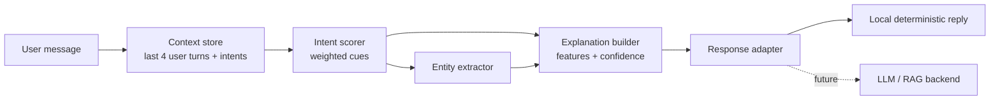

# Explainable LLM Agent

A research prototype of a **transparent, rule-based conversational router**. Intent decisions, bounded context carryover, and explanations are all derived from one deterministic scoring pass, so every displayed reason is an actual score contribution.

> **Important:** despite the repository name, the local inference engine is deterministic and rule-based. It is **not** a trained LLM. LLM/RAG integration is a future backend path.

## Problem
Conversational systems often expose an answer without exposing the evidence that drove routing, confidence, or context use. This prototype explores a more auditable design in which intent decisions, context carryover, and explanations come from the same scoring process.

## What is implemented
- Transparent keyword/phrase feature attribution for intent routing (6 intents + `fallback`).
- Confidence-aware abstention with an explicit threshold (`0.32`).
- Entity extraction with character spans (whole-word matches only).
- Bounded context window of the last **four user turns**, with the carryover contribution shown explicitly.
- Interactive decision inspector.
- Evaluation dashboard, a multi-turn context regression set, and a cue-removal sensitivity check.
- Responsive UI, light/dark theme, no external API key required.

## Architecture



All model parameters (cue lists, weights, threshold, carryover, confidence formula, entity lists) live in **`js/model.js`**. The browser demo (`js/shared.js`) and the evaluator (`tools/evaluate.py`) both read that single file, so they cannot drift apart.

## Explainability method
**Feature attribution / rule-contribution explanation.** Each matched keyword (+1) or phrase (+2.2) adds a configured amount to an intent score. The UI exposes the matches, their weights, confidence, alternatives, the threshold decision, entities, and model version. This is faithful to the implemented scorer by construction and does not rely on a model-written paragraph that claims to explain itself.

For a future neural classifier, SHAP/LIME or architecture-specific attribution could be evaluated. For a future RAG backend, retrieval source IDs and citations should become first-class explanation fields.

## Scoring and confidence
- Score per intent = 1 × (keyword matches) + 2.2 × (phrase matches). Matching is case-insensitive and whole-word.
- Confidence of the top intent = `min(0.98, 0.45·(top/total) + 0.55·(1 − e^(−top/2.2)))`.
- If confidence < `0.32`, the router abstains and returns `fallback`.

## Context-awareness mechanism
The demo keeps the four most recent **user** turns (text + routed intent); assistant replies are not stored. When a message has at most one matched intent and seven or fewer words, the most recent non-`fallback` intent in the window adds a fixed `+0.6` to its score. The inspector states when this was used, including the case where the whole score comes from carryover. "Clear routing memory" empties the window but does not delete the visible transcript.

## Example conversations
**1. Internship routing** — `How should I prepare for an OIST internship?` → `internship`. Evidence: `internship`; entities: `oist`, `internship`.

**2. Technical routing** — `Explain Transformer convergence.` → `technical`. Evidence: `transformer`; alternatives and threshold decision shown.

**3. Context carryover** — `I am applying for a research internship in Japan.` → `internship`; then `What should I prepare?` has no direct cue, so the previous `internship` intent contributes `+0.6` (confidence ≈ 58%), and the inspector says so.

## Evaluation
Run:

```bash
python3 tools/evaluate.py                # JSON report
python3 tools/evaluate.py --table        # readable report
python3 tools/evaluate.py --check-js     # also verify Python == JavaScript (needs Node)
```

The development set (`data/dev_set.json`) is **hand-authored for regression testing**. It is not an external benchmark and the cue lists were written alongside the examples, so perfect scores are expected and say nothing about generalization.

| Measure | Result |
|---|---:|
| Development examples | 32 |
| Accuracy | 100% |
| Macro F1 (7 classes incl. fallback) | 1.00 |
| Fallback rate | 6.25% (2 of 32) |
| Average confidence | 71.57% |
| Cue-removal sensitivity | 100% (over 30 examples that cite a cue) |
| Multi-turn context cases | 100% (6 cases) |

## Faithfulness / cue-removal sensitivity
For every example that cites at least one cue, the evaluator masks those cues and re-scores the **original predicted intent**. A case is sensitive when that score decreases. Abstentions cite no cues and are excluded from the denominator.

Because the scorer is additive, removing a cited cue always lowers its score, so this check is expected to pass by construction. It verifies that the implementation and its explanations agree; it is **not** a human evaluation of helpfulness and does not show generalization.

## Run locally
```bash
python3 -m http.server 8080
# then browse to http://localhost:8080/
```
Pages also work when opened directly from disk. No build step and no API keys. (Fonts load from Google Fonts when online and fall back to system fonts offline.)

## Repository structure
```text
neuralcontext/
├── index.html                                   overview
├── xai-assistant-conversational-intelligence.html   live demo + decision inspector
├── xai-interactive-dashboard.html               evaluation (computed values)
├── technical-architecture.html
├── neuralcontext-landing-page.html              short research overview
├── context-and-memory-management.html
├── model-and-rag-configuration.html
├── performance-metrics.html
├── technical-implementation-and-api-docs.html   prediction contract + future API
├── deployment-and-mlops-dashboard.html          reproducibility notes
├── 404.html
├── css/shared.css
├── js/model.js                                  single source of truth for the router
├── js/shared.js                                 UI + classifier
├── data/dev_set.json                            dev set + context cases
├── tools/evaluate.py                            reference evaluator
├── assets/favicon.svg
└── README.md
```

## Research questions / future work
1. How stable is transparent routing under paraphrase?
2. Does context carryover improve short follow-up routing without increasing false associations?
3. Do cited cues remain faithful when the scorer is no longer additive?
4. How does the confidence threshold trade off coverage and abstention?
5. How does a trained neural classifier compare with this transparent baseline?
6. Can retrieval source attribution improve factual traceability in a future RAG backend?

## Limitations and non-claims
This project does not claim production readiness, external benchmark performance, a trained LLM, SHAP/LIME results, attention interpretability, live retrieval, or human-subject findings. These are explicit future-work directions.

## License / contribution
Add the preferred project license before public release. Contributions should preserve reproducibility and distinguish implemented measurements from hypotheses or future work.
